# CarFun Quiz

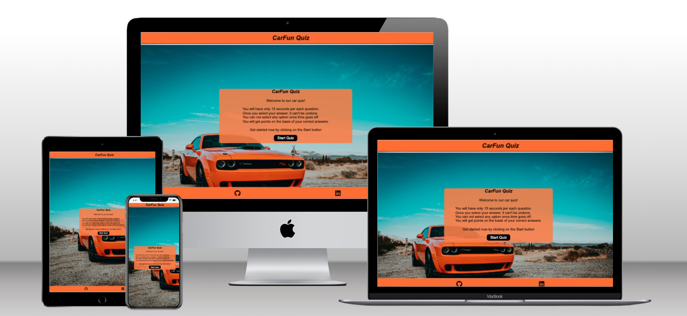

#### [The live website link](https://naviid24.github.io/pp2-carfun-quiz/)

# Purpose

- The CarFun Quiz is an online multiple-choice quiz game website focused on the driving and car questions . The quiz is targeted towards the people (adults and children) who love to know something weird about distance and rules and cars facts.
- The users can test their knowledge of all things driving related with CarFun Quiz, 10 question quiz! From famous car manufacturers to rules of the road.

# Quiz Rules

- You will have only 15 seconds per each question.
- Once you select your answer, it can't be undone.
- You can not select any option once time goes off.
- You will get points on the basis of your correct answers.
-----

# User Experience (UX) and Design

## User Stories

- As a user, I want to see an image that clearly shows what the quiz is about and the main purpose of the site.
- As a user, I want to easily navigate through the site and find the quiz content.
- As a user, I want to have an interactive button option to start the quiz.
- As a user, I want to see which question I am on.
- As a user, I want to see the questions and the options I get with it.
- As a user, I want to see if the answer I have chosen is right or wrong before moving on to the next question.
- As a user, I want to se how much time I have to answer the question.
- As a user, I want to see my final score.
- As a user I want to have a chance to do the quiz again.
  
#### All the users want to be able to access and view the website comfortably on mobile, tablet and desktop devices

## Design

### Wireframes

#### **Large to Medium and small Screen Size**

The heading in the header section of the website is styled with hover effect for better readability and user experience.

### **Home Page**

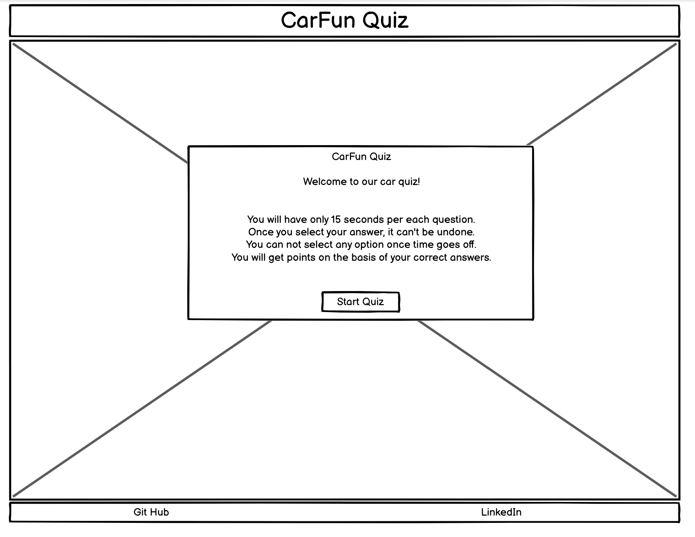

### **Quiz Section**

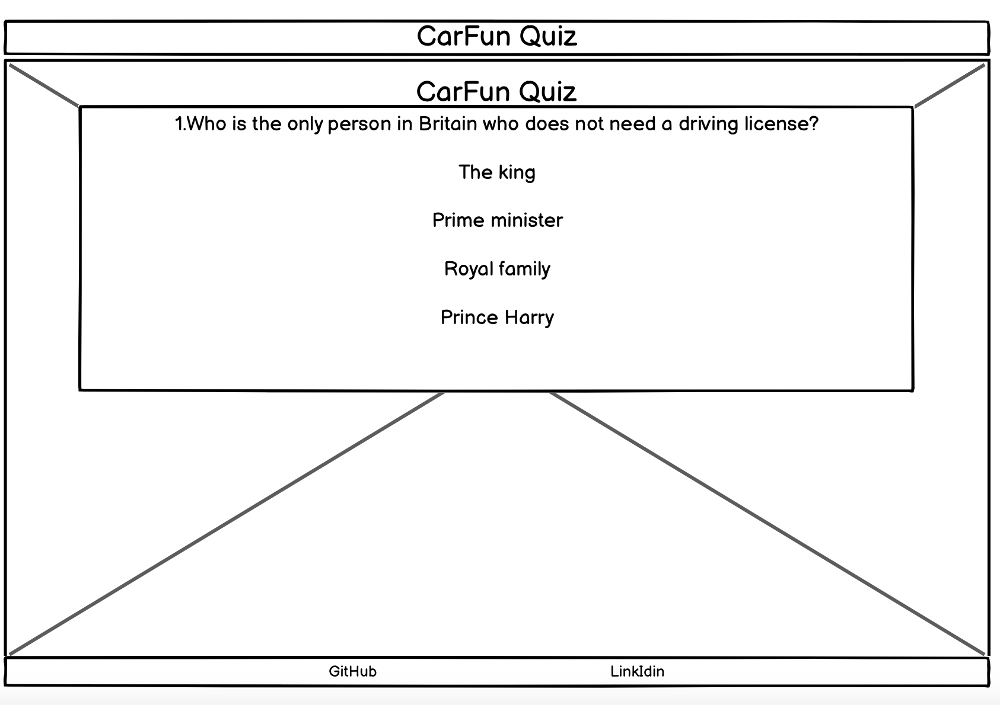

### **404-Error Page**

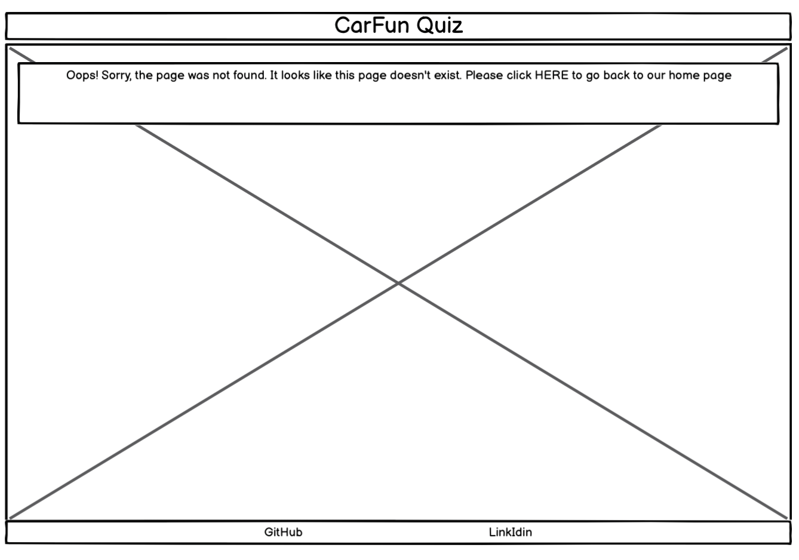

#### **Mobile Screen Size**

### **Home Page**

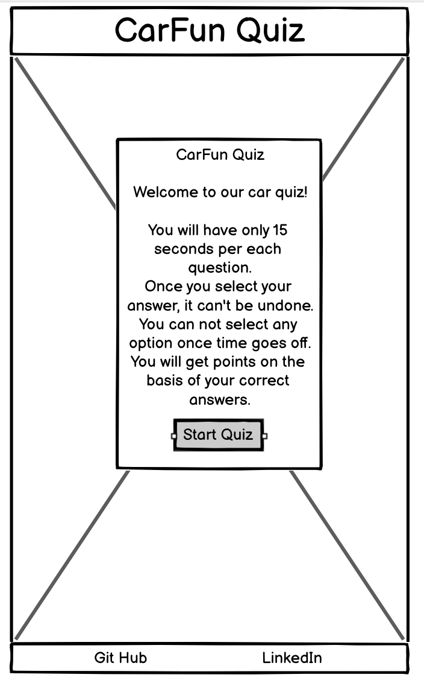   

### Typography

The fonts for the website is taken from Visual Studio Code .

- Arial, Helvetica, sans-serif.

### Images

- The image in this project is sourced from [pexels](https://pexels.com/). Image was specifically selected to correlate with the main purpose of the website and to give user an imagery representation for the content to increase the impact of the design.
- The logo image for the website is sourced from [google](https://www.google.com/)

### Visual Effects

#### Hover Effect for heading and footer icon and buttons

- The main heading of the website and Start button and logos in the footer on home page is givven hover effect to make the user experience more interactive.
- The buttons on all pages have a transition and hover effect. When user clicks or hovers over the button a transition effect with colour change is experienced.
- The background-color of the home page's content and quiz section styled with gray background with opacity to make background clear and more attractive for users.
- 

-----

# Features

## Existing Features

### Main Header

- The main header with logo image is shown on every page centered on top of the page for consistent design.
- The header includes a link which user can use if they want to be taken back to home page. The link allows user to easily navigate through the page making the site more interactive.
- When the header text is hovered over, it will change the colour with a shadow effect, so that the user will be aware of the link. The header is responsive throughout all devices from small screens, tablets to desktop.
  
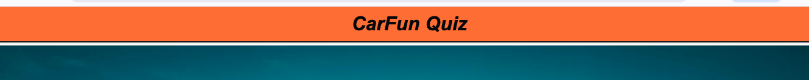

### The Home Page

- The home page contains background image and a simple overlay text block with a welcome message that will attract attention of the user.
- The color is set with the car's color and orange color has been laid out smoothly with the blue color and made it a nice and more attractive for user expeience.
- The overlay block is same throughout the website for better user experience.
- The start button on home page when clicked starts the quiz and takes the user to the quiz page.
  
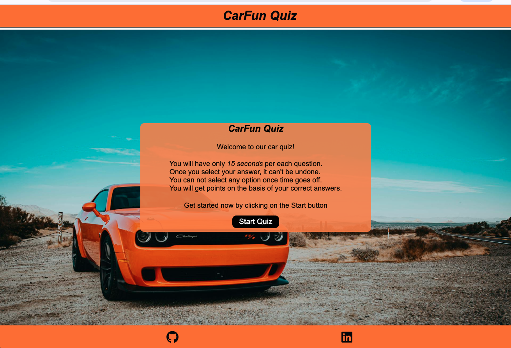

### The Quiz Game Section

- This is the section where the user will be able to see questions and answer buttons.
- The user will be able to select correct answer. The answer if correct will be highlighted in green colour and the wrong answer with red colour.
- After the user chose and clicked on his answer next button will be appeared and user is able to click on the next button to go foe next question.
- At the end of the game user will see how many question answered correctly.
  
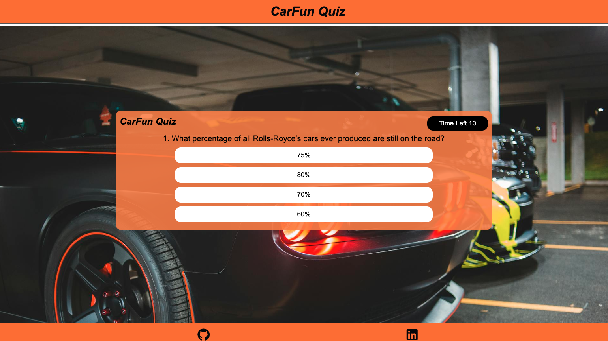

### The Footer Section

- Similar to the main header, the footer shows on every page below the quiz section on the website. It displays icon links to GitHub and LinkedIn accounts. These icon links can enable user to see more about my work through GitHub and learn more about me through LinkedIn.
- The color of the footer is matched with header and color of the background-image.

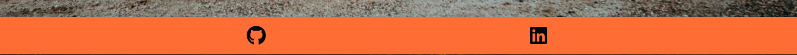

### The 404-Error Page

- This page will show to user if a wrong link for the page is entered.
- The design for the page is simple stating the message.
- This page gives a clear instructions with the link to go back to home page. The user will not have to use the browser's back button and can navigate through website without leaving it.

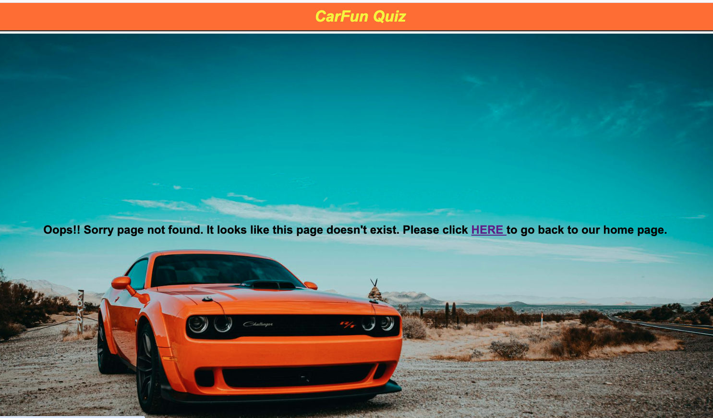

## Testing

### Responsiveness

- The site is designed to be flexible, fluid and responsive on all screen sizes. Website have been checked for responsiveness through Chrome Development tools. In order to do this, the following steps are taken:
  1. Open the browser.
  2. Navigate to The CarFun Quiz website <https://naviid24.github.io/pp2-carfun-quiz/>
  3. Right click anywhere on the page and go to "Inspect" to open Development Tools.
  4. Click on drop down menu: "Dimensions: Responsive" and choose "Responsive".
  5. Drag the side of the screen and change screen size, making sure the website looks good from 320px and up. Here, ensure there is consistency in design of the website on every screen size from small(mobile devices) to larger(desktop devices) and no scorll bar is showing for layout of site.

- Expected Result: Each page section is responsive and user friendly when viewing the website on small and large screens.The website have no design or accessibility issue in any of the screen sizes from 320px and up.
- Actual Result: After using media queries targeted to specific screen sizes, website is responsive with no scroll bar showing, the content is accessible to user to read. Website is user friendly on small to large screen sizes.

- The following devices are used to check responsiveness of the website:
  - Samsung S20 FE 5G
  - Samsung Galaxy s8+
  - iphone 12 pro
  - Microsoft Surface Pro
  - Apple ipad Air
  - Google Pixel 7

### Accessibility Errors

- Each page is checked with the help of WAVE Accessibility tool (<https://wave.webaim.org/>).
- Home page and quiz page had erros, because I didn't use aria-label attribute for a elements in the footer section in each page and after I added aria-label attribute to them, the errors were solved.

- Accessebility test result with errors [test-photo](assets/errors&warnings/accessebility-test-with-errors.png)
- Accessebility errors description      [test-photo](assets/errors&warnings/accessebility-test-errors.png)

### Accessibility passes

- Each page passes accessibility test with no error for:
  - contrast
  - aria- labels for users who use screen-readers.
  - alternative text as a function for screen readers or in events if the images don't load.
  - structural elements: for users of assistive technology as well as visual and semantic meaning.
  - language of the document for screen readers.

- Accessibility test result for home page [test-photo](assets/errors&warnings/accessebility-test-home-pageno-errors.png)
- Accessebility test result for quiz page [test-photo](assets/errors&warnings/accessebility-test-quiz-section-errors.png)
- Accessebility test result for 404 page  [test-photo](assets/errors&warnings/accessebility-test-404page-no-errors.png)

### Manual Testing

Manual testing is performed to ensure website performs well on different browsers and devices.

- Testing for different browsers was carried on using [BrowserStack](https://www.browserstack.com/?utm_source=google&utm_medium=cpc&utm_platform=paidads&utm_content=668760067900&utm_campaign=Search-Brand-EMEA-Navigational&utm_campaigncode=Core+1006598&utm_term=e+browserstack) and manually on some of the browsers.
  - Chrome
  - Safari
  - Microsoft Edge
  - Firefox
  - Internet Explorer

- No issue was detected in the website while cross-browser testing. The website is fully responsive on the mentioned browsers.
- For testing on different devices the website link was shared with my friends and family. The website was fully responsive with no issues on following devices:
  
  - Samsung S20 FE 5G
  - Samsung Galaxy A50s
  - Iphone 12
  - One Plus Nord CE
  - Microsoft Surface Pro
  - Apple ipad Air
  - Moto G

### Lighthouse

- Lighthouse Score for Desktop:
  
  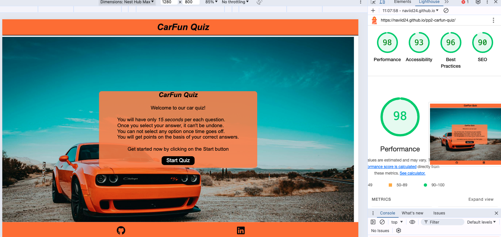

- Lighthouse Score for Mobile:

  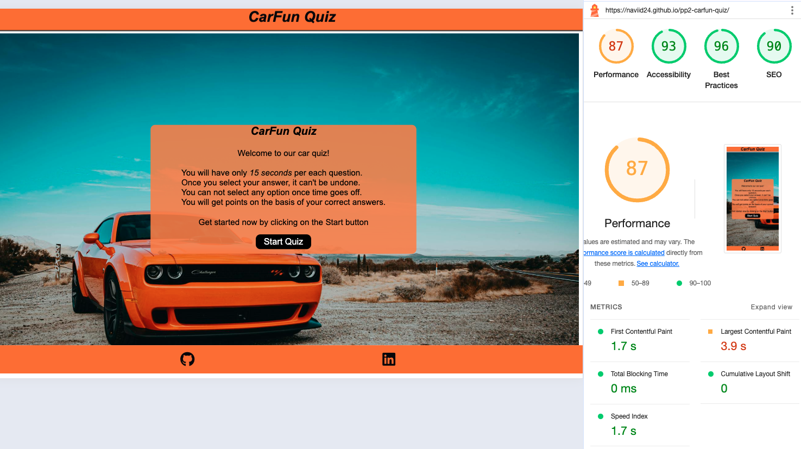

### Functional Testing

- Buttons and anchor links
  - All links and buttons checked and works as expected
  
  | Button / anchor link (Location)            |  Destination Page                     | Page Opens In New Tab |
  |---------------------------------------------|---------------------------------------|-----------------|
  | "Start Quiz" (home page)                    | index.html / 1st question displayed   | no - as expected |
  |"Answer button" (answer is selected)         | index.html /  next question displayed  | no - as expected|
  | "Play again button" (index.html / displayed below final score)| index.html with first question displayed | no - as expected |
  | Home Page link (Header link) | index.html    |index.html                             | no - as expected |
  | "GitHub" icon (footer section)               |  <https://github.com/Naviid24>        |  yes - as expected |
  | "LinkedIn" icon (footer section)             |  <https://www.linkedin.com/in/navid-bahadorani-44a513299/> | yes - as expected  |

- Functionality Testing
  - As a User, I have tested website as follows:

     1. Home Page / index.html:
          - User clicks on "Start Quiz" button, user is taken to the quiz game page and question numbers are displayed.
     2. Quiz Game Section / index.html:
           - User selects one of the answer buttons, if the answer is correct, the button is highlighted in green colour.
           - If the selected answer is wrong, the button is highlighted in red colour and simultaneously correct ones is highlighted with green colour.
           - With each answer button selected next question is displayed. The question is incremented by 1.
     3. Score Section / index.html:
           - User completes the 10 questions of quiz, final score with number of correct questions answered to complete the quiz is displayed.
         - User clicks on the "Try again" button, user is taken back to quiz section and first question will be displayed.

     4. All the hover and opacity effects on text and buttons works as expected.

### Validator Testing

- HTML Validation
  - No errors were found when passing through the official W3C Validator

    

- CSS Validation
  - No errors were found when passing through the official Jigsaw W3 Validator

   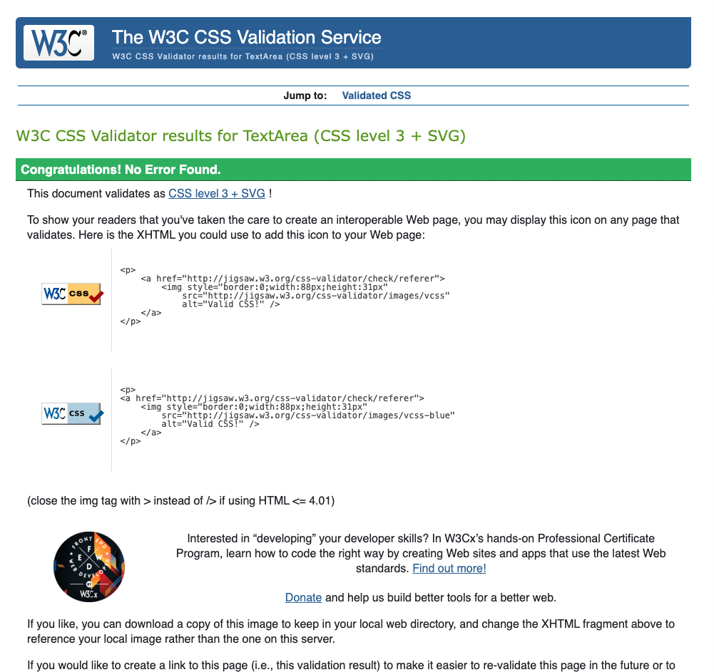

- JavaScript Validation
  - No errors were found when passing through the jshint validator.

   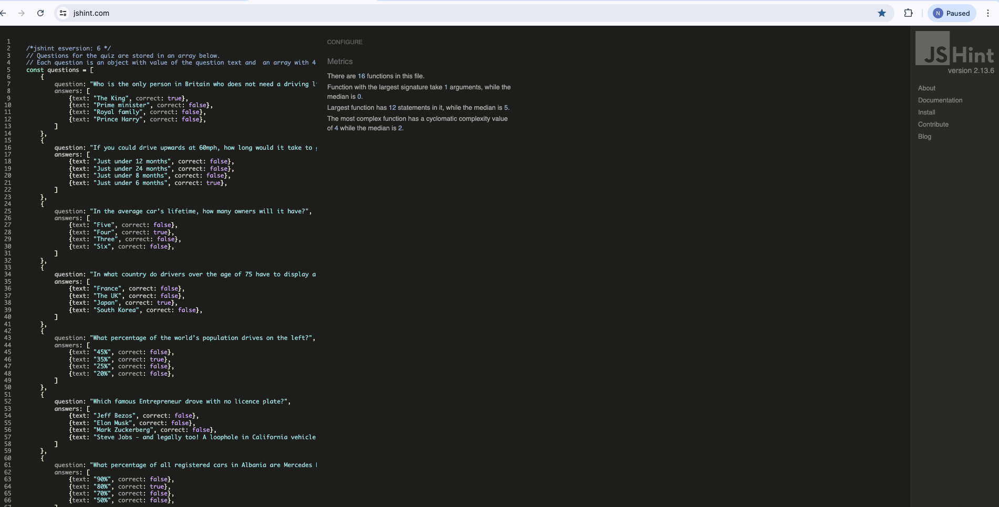

### Unfixed Bugs

- No bugs where detected while testing the website on browsers and devices(small, medium and large screen sizes). All pages are fully functional and responsive to the browers and devices. The consistency in design is maintained throughout.

## Version Control

The website was developed through Codeanywhere IDE.

Code has been pushed to repository on Github with following git commands:

- git add . - to add files ready to commit.
- git commit -m "message" - to commit the code to local repository ready to be pushed.
- git push - final command used to push committed code to remote repo on Github.

## Cloning the Repository

1. On Github navigate to the repository "Naviid24/project-2-carfun"
2. Click "Code" drop down menu - a green button shown right above the file list.
3. Copy the URL of the repository using "HTTPS", "SSH" or "Github CLI".
4. Open Git Bash.
5. Change the current working directory to the location where you want the cloned directory.
6. Type "git clone", and then paste the URL copied earlier.
7. Press enter to create local clone. A clone of the repository will now be created.

- For more details on how to clone the repository in order to create a copy for own use refer to the site:<https://docs.github.com/en/repositories/creating-and-managing-repositories/cloning-a-repository>

## Forking

1. On Github navigate to the repository "Naviid24/project-2-carfun"
2. Click "Fork" located towards top right corner on GitHub page.
3. Select "owner" for the forked repository from the dropdown menu under "owner".
4. It will create forked repo under the same name as original by default. But you can type a name in "Repository name" or add a description in "Description" box.
5. Click on "Create fork". A forked repo is created.

- Forking allows you to make any changes without affecting original project. You can send the suggestions by submitting a pull request. Then the Project Owner can review the pull request before accepting the suggestions and merging them.
- When you have fork to a repository, you don't have access to files locally on your device, for getting access you will need to clone the forked repository.

## Deployment

- The website was deployed to Github Pages using following steps:
  
1. Go to GitHub repository.
2. Click on "Settings".
3. Click on "Pages"(tab on the left sidebar).
4. Scroll to "Build and deployment"/"Source" section.
5. Find the sub-section "Branch".
6. From the drop-down menu "none"/"select branch" and choose source "main" (or "master").
7. Click 'Save'
8. Wait until you can see a link for deployed page within GitHub Page section. This can take a while. Once the page updates you will see a message: Your site is live at <https://naviid24.github.io/pp2-carfun-quiz/>

# Technologies

- HTML - used to create the main structure of the website.
- CSS - used to style the website.
- JavaScript - used to create dynamic content and make page interactive
- GitPod built-in formatter to format structure for HTML and CSS files in the project.
- [GitPod](https://www.gitpod.io) IDE to develop the website.
- [GitHub](https://github.com/) to host the source code and GitHub Pages to deploy and host the live site.
- Git to provide the version control to commit and push code to the repository.
- [Google Fonts](https://fonts.google.com/) for typography.
- [FontAwesome](https://fontawesome.com/v5/search) v5.15.4 for website icons.
- Google Chrome Dev Tools for inspecting, debugging pages and testing layouts.
- [Cloudconvert](https://cloudconvert.com/jpg-to-webp) to convert .jpg images into .webp to reduce storage and enhance the website performance.
- [TinyJPG](https://tinyjpg.com/) to optimise images for website.
- [Freepik](https://www.freepik.com/) to source the main logo image.
- [WallpaperAccess](https://wallpaperaccess.com/) to source the website background image.
- [Favicon.io](https://favicon.io/) to create the website favicon.
- Balsamiq to design the wireframes for the website.
- [Am I Responsive](http://amiresponsive.blogspot.com/) to create the Mockup image in this README.
- Google Chrome's Lighthouse to test accessibility for desktop and mobile devices.
- [WAVE](https://wave.webaim.org/) evaluation tool to test the website for accessibility to individuals with disabilities.
- [W3C HTML Markup Validator](https://validator.w3.org/) to validate the HTML Code.
- [W3C Jigsaw CSS Validator](https://jigsaw.w3.org/css-validator/) to validate the CSS Code.
- [jshint validator](https://jshint.com/) - used to check java script code for errors.
- Code Institute's GitPod Template to generate the workspace for the project.
- BrowserStack for cross-browser testing.

# Credits

- The website's background image is from the pexels website from (www.pexels.com).
- FontAwesome for all the icons used in the website.
- Questions for the quiz are taken from: <https://www.swinton.co.uk/spotlight/driving/quiz-10-fun-car-facts>
- Basic structure and understanding about quiz website taken from: <https://www.youtube.com/watch?v=riDzcEQbX6k&t=2s>
- Kevin Powell videos
- Google
- w3schools
- JavaTpoint JavaScript tutorials
- Love Maths project from Code Institute for general help.
- Readme structure from my last project: <https://github.com/Naviid24/project-1/blob/main/README.md>

## Acknowledgements

- I would like to thank my mentor, John for his valuable feedbacks, guidance, support and help in planning the project.
- Thank you Slack Community for answering all my questions and doubts.
